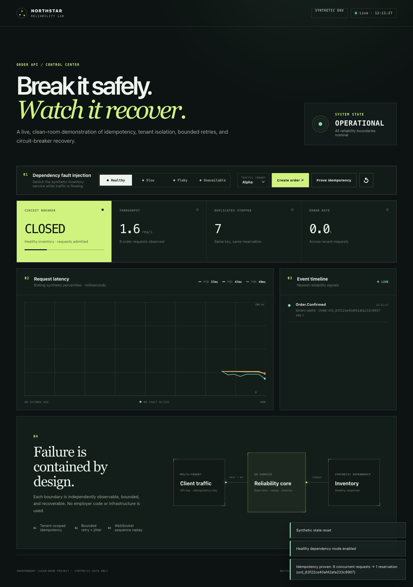
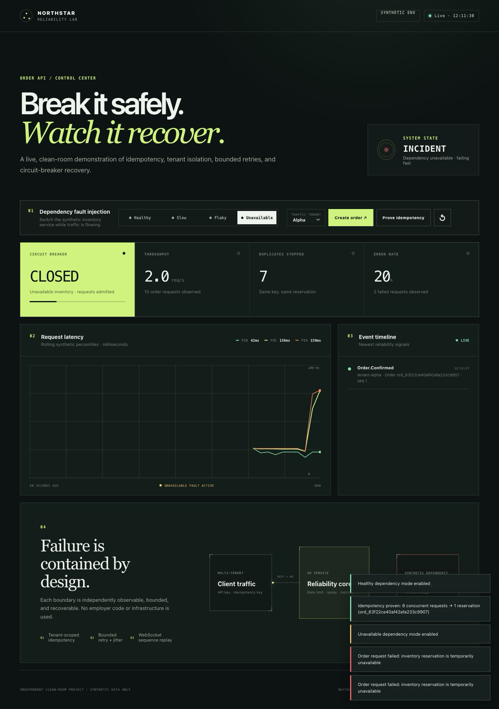
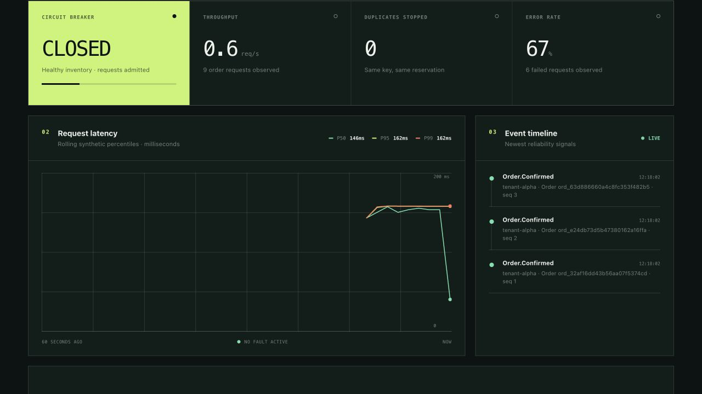
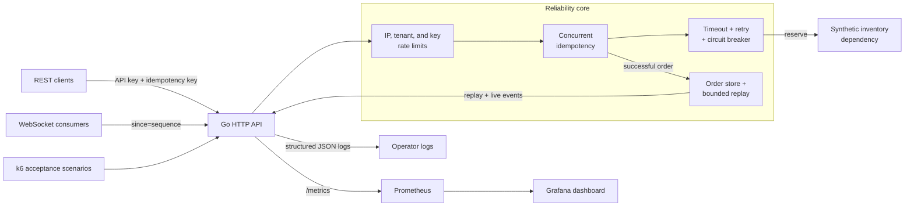
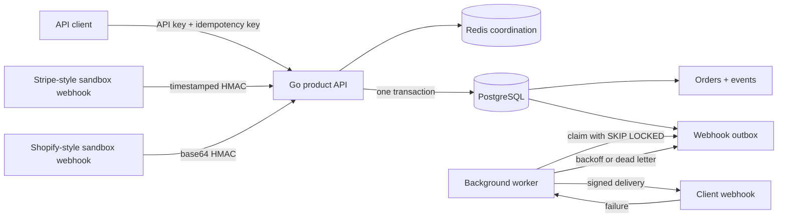

# Northstar API Reliability Lab

> A production-minded Go reference service that shows how to keep a multi-tenant API correct and observable when clients retry, traffic spikes, dependencies fail, and WebSocket consumers reconnect.

[](go.mod)
[](LICENSE)
[](PROVENANCE.md)

Northstar Tickets is a fictional reservation API built as a hands-on portfolio project. It turns common production incidents into repeatable acceptance scenarios: a duplicate order burst, an overloaded tenant, an unavailable inventory service, and a disconnected event consumer. Every scenario can be run locally and inspected through structured logs, Prometheus, Grafana, or the built-in control center.

**Why this matters to a client:** the repository demonstrates the engineering work behind stabilizing payment, booking, order, webhook, and third-party API integrations—without depending on a proprietary platform or a slide-only architecture.

The repository now has two deliberately separate runtimes:

- the **Reliability Lab** on port `8080`, a zero-dependency fault-injection environment for fast visual review;
- the **Product Runtime** on port `58081`, a deployable PostgreSQL/Redis service with transactional outbox delivery, signed webhooks, retries, dead letters, and Stripe/Shopify-style sandbox adapters.

## See the system recover

### Healthy control center



### Injected dependency failure



### Verified recovery



[Watch the short duplicate-request and dependency-recovery walkthrough](artifacts/video/northstar-reliability-demo.mp4).

The web control center is served by the Go application at <http://localhost:8080/>. Use it to create orders, replay an idempotent request, change the synthetic dependency between `healthy`, `slow`, `flaky`, and `unavailable`, and watch the service state change.

## Three guarantees, with executable proof

1. **One logical request creates one order.** A tenant-scoped idempotency registry coordinates concurrent requests and returns the original result for completed duplicates. Run `make idempotency` to submit 20 concurrent requests with one key and verify that they resolve to one order ID.
2. **A failing dependency cannot trigger unbounded work.** Each inventory attempt has a timeout; retries have a fixed attempt budget, backoff, and jitter; repeated failure opens a circuit that returns fast `503` responses. Run `make dependency-recovery` or `make demo` to observe the failure and recovery path.
3. **A reconnecting consumer can recover retained events in order.** Successful transitions receive monotonic sequence numbers and enter a tenant-scoped replay buffer. A WebSocket client reconnects with `?since=<sequence>` to receive its retained gap. Run `make websocket-replay` to verify ordering.

The service also applies separate IP, tenant, and API-key token buckets so one noisy client is deliberately shed with `429` responses instead of consuming all request capacity.

## Architecture



The reliability policies live behind explicit boundaries rather than being scattered across handlers. See [the architecture notes](docs/ARCHITECTURE.md) and [ADR-001](docs/ADR-001-reliability-boundaries.md) for the request path and rationale.

### Product runtime



The order, event, and outgoing notification are committed atomically. Redis suppresses duplicate work across replicas, while PostgreSQL's tenant/idempotency unique constraint remains the correctness boundary if Redis is unavailable. See the [product architecture and runbook](docs/PRODUCT_RUNTIME.md).

## Quick start

### Run with Go

Requires a patched Go 1.25 release or newer. CI and the production container pin Go 1.25.12.

```bash
DEMO_MODE=true go run ./cmd/server
```

Then open <http://localhost:8080/> or check the service:

```bash
curl --fail http://localhost:8080/healthz
curl --fail http://localhost:8080/readyz
```

The server listens on `:8080` by default. Set `ADDR=:9091` to use a different address. Demo routes are disabled by default; `DEMO_MODE=true` enables the local fault-injection, reset, and snapshot routes used by the control center. Docker Compose enables them for the isolated lab.

### Run the complete Docker lab

Requires Docker with Compose v2.

```bash
make up
docker compose ps
```

This starts the API, Prometheus, and a provisioned Grafana dashboard. Shut down the stack with `make down`; monitoring volumes are preserved.

### Run the durable product runtime

Requires Docker with Compose v2:

```bash
make product-up
make product-demo
```

This starts PostgreSQL, Redis, the product API, and a local webhook receiver that deliberately rejects its first two attempts. The demo proves that the first request creates one order, an identical retry returns the same order, and the signed webhook eventually succeeds after bounded retry. Product data is stored in named volumes; `make product-down` stops services without deleting it.

The sample API keys and secrets in `compose.product.yaml` are local-only fixtures. A real deployment must inject rotated secrets through its platform secret manager.

## Create an idempotent order

The included keys identify fictional tenants and are safe demo values.

```bash
curl -i -X POST http://localhost:8080/v1/orders \
  -H 'Content-Type: application/json' \
  -H 'X-API-Key: tenant-alpha-key' \
  -H 'Idempotency-Key: readme-example-001' \
  -d '{"event_id":"event-summer-jazz","quantity":2}'
```

The first request returns `201 Created`:

```json
{
  "order": {
    "id": "ord_f7923313637ed3c30bef6f6f",
    "tenant_id": "tenant-alpha",
    "event_id": "event-summer-jazz",
    "quantity": 2,
    "status": "confirmed",
    "created_at": "2026-07-26T03:58:43.98493Z",
    "updated_at": "2026-07-26T03:58:43.98493Z",
    "sequence": 1
  },
  "replayed": false
}
```

IDs and timestamps are generated at runtime. Repeat the same payload with the same tenant and idempotency key: it returns `200 OK`, the same order, and `"replayed": true`. Reusing that key with a different payload returns `409 Conflict` instead of silently applying the wrong result.

## Reproduce a failure and recovery

With the Docker lab running, keep the control center or Grafana visible and run:

```bash
make demo
```

The narrated script performs five verifiable steps:

1. resets the synthetic environment;
2. submits 20 concurrent copies of one logical request and checks for one order ID;
3. makes inventory unavailable and generates requests until the circuit opens;
4. restores the dependency, waits for the breaker cooldown, and runs a recovery probe;
5. prints the service snapshot and local observability links.

For manual fault injection:

```bash
curl --fail -X POST http://localhost:8080/v1/demo/fault \
  -H 'Content-Type: application/json' \
  -d '{"mode":"unavailable"}'

curl --silent http://localhost:8080/v1/demo/snapshot | jq .
```

Return the simulator to healthy mode by sending `{"mode":"healthy"}` to the same endpoint.

## Tests and reproducible evidence

```bash
make test                  # Go unit and HTTP integration tests
make test-race             # the same suite with Go's race detector
make validate              # formatting, vet, tests, Compose, dashboard JSON

make smoke                 # short healthy-path k6 scenario
make idempotency           # concurrent duplicate suppression
make dependency-recovery   # circuit opening and recovery
make rate-limit            # deliberate noisy-tenant shedding
make websocket-replay      # ordered reconnect gap recovery

make product-integration   # real PostgreSQL/Redis transaction and failover tests
make product-demo          # durable idempotency + signed webhook retry proof
```

Generate a machine-readable acceptance report against the running lab:

```bash
go run ./cmd/replay \
  -base-url http://localhost:8080 \
  -output artifacts/reports/replay-report.json
```

A captured example is available at [`artifacts/reports/replay-report.json`](artifacts/reports/replay-report.json). It records scenario evidence rather than presenting environment-specific timings as a universal benchmark.

The product path has a separate [validation report](artifacts/reports/product-runtime-validation.md) recording the real PostgreSQL/Redis assertions, signed retry result, container build, and local tool versions used for the run.

This repository intentionally does **not** publish a universal throughput or latency claim. Results depend on the commit, machine, container runtime, and scenario parameters. To produce evidence that another engineer can audit, record:

- the Git commit and `docker version`;
- the k6 command plus any environment overrides;
- the host CPU/memory and whether Docker resource limits were used;
- the complete k6 summary and relevant Grafana time window.

The scenario checks are the stable result: correctness under duplicate concurrency, bounded dependency failure, explicit overload shedding, and ordered replay. Performance measurements are reproducible observations of a stated environment—not marketing constants.

## Observability

After `make up`:

| Interface | Local URL | Purpose |
| --- | --- | --- |
| Control center | <http://localhost:8080/> | Interact with the synthetic service and inject faults |
| Service snapshot | <http://localhost:8080/v1/demo/snapshot> | Inspect current dependency, breaker, counters, and recent events |
| Prometheus metrics | <http://localhost:8080/metrics> | Raw low-cardinality application metrics |
| Grafana dashboard | <http://localhost:3000/d/northstar-reliability> | Request, dependency, and recovery signals |
| Prometheus targets | <http://localhost:9090/targets> | Verify the scrape path is healthy |

Metrics cover HTTP outcomes and latency, order results, dependency calls, duplicates suppressed, rate-limit rejection, and circuit state. Tenant IDs, API keys, order IDs, and idempotency keys are deliberately excluded from metric labels to avoid unbounded cardinality. The [operator runbook](docs/RUNBOOK.md) provides triage and recovery playbooks.

The product runtime exposes liveness at `:58081/healthz`, dependency readiness at `:58081/readyz`, and low-cardinality metrics at `:58081/metrics`. Authorized operators can inspect deliveries through `GET /v1/webhook-deliveries?status=dead_letter` and explicitly replay a dead letter through `POST /v1/webhook-deliveries/{id}/retry`.

## Repository map

```text
cmd/server/                    service entry point and graceful shutdown
cmd/replay/                    machine-readable acceptance report runner
cmd/product-server/            PostgreSQL/Redis product runtime
cmd/webhook-sink/              signed local receiver with deterministic failures
internal/app/                  order workflow and reliability composition
internal/domain/               synthetic order and event contracts
internal/httpapi/              REST, WebSocket, auth, limits, and telemetry
internal/product/              durable orders, Redis coordination, outbox, integrations
internal/reliability/          idempotency, retry, circuit breaker, rate limit
internal/store/                in-memory orders and bounded event replay
internal/telemetry/            Prometheus metric definitions
internal/upstream/             deterministic dependency fault simulator
web/                           zero-build control center
tests/load/                    k6 acceptance and load scenarios
deployments/                   Prometheus and Grafana provisioning
scripts/demo.sh                narrated duplicate/failure/recovery demo
scripts/product-demo.sh        durable order and signed webhook acceptance demo
artifacts/                     portfolio screenshots and captured evidence
docs/                          specification, architecture, ADR, and runbook
.github/workflows/             formatting, race, build, and asset validation
```

## Design tradeoffs

- **Two runtimes, two honest purposes.** The visual lab keeps in-memory state so fault policies remain easy to inspect. The product runtime uses PostgreSQL and Redis where restart safety and multi-replica coordination matter. Neither mode pretends to be the other.
- **Durable correctness does not depend solely on Redis.** Redis avoids duplicate work on the fast path. PostgreSQL owns the final `(tenant_id, idempotency_key)` uniqueness rule, so a coordination outage degrades efficiency and readiness without allowing duplicate orders.
- **Transactional outbox over best-effort callbacks.** Order, event, and delivery records commit together. Workers claim due rows with `FOR UPDATE SKIP LOCKED`, recover expired processing leases, sign the exact stored payload, apply bounded exponential backoff, and retain exhausted work as a dead letter.
- **Bounded replay, not an event platform.** The application retains 500 synthetic events. A cursor older than the buffer requires REST reconciliation in a production design.
- **Simple reference identity.** Static API-key mappings demonstrate tenant isolation. Production identity still requires a secret manager, rotation, role-based authorization, and an audit trail.
- **Safe local operations, not a public control plane.** Fault and reset endpoints are available only in demo mode. Grafana is anonymous and read-only for local use; neither configuration belongs on an internet-facing deployment.
- **Adapter examples, not live commerce credentials.** Stripe- and Shopify-shaped endpoints verify their real HMAC formats but consume synthetic payloads and make no external payment or store calls.
- **Explicit next production boundaries.** A customer deployment would add managed backups, migration locking, per-tenant integration secrets, alert routing, network policy, audit logging, and load-derived capacity limits.

## Clean-room and provenance

This project was designed independently from a blank repository using fictional tenants, generated data, and public specifications. It contains no employer source code, configuration, schemas, traffic, logs, benchmarks, screenshots, or private architecture. Read the full [provenance statement](PROVENANCE.md).

## Author and contact

Built by **Sijie Zhang**, a backend engineer focused on Go services, distributed systems, API integrations, and production reliability.

- GitHub: [@loveyuanfandj-glitch](https://github.com/loveyuanfandj-glitch)
- Email: [loveyuanfandj@gmail.com](mailto:loveyuanfandj@gmail.com)

For the short client-facing narrative, see the [case study](docs/CASE_STUDY.md). This repository is available under the [MIT License](LICENSE).
