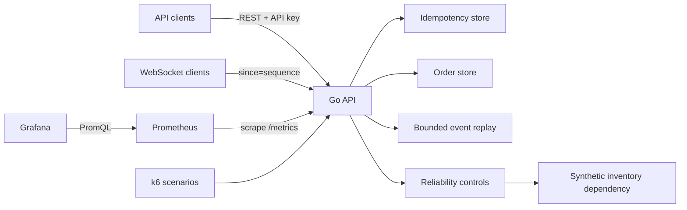
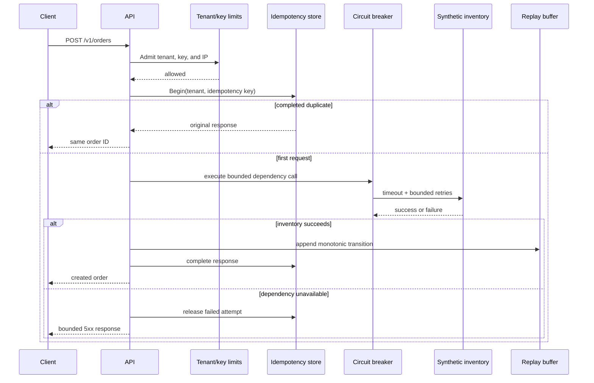

# Architecture

Northstar Tickets is a synthetic multi-tenant reservation service built to make
four reliability properties observable: duplicate suppression, tenant
isolation, bounded dependency failure, and ordered event recovery. The project
uses only generated data and publicly documented protocols.

## System context

The in-process stores and dependency are intentional. They keep the portfolio
demo deterministic and make the reliability logic inspectable without hiding
it behind infrastructure. Production deployments would replace these stores
with durable, shared components while preserving the same boundaries.

## Order request path

The idempotency owner coordinates concurrent duplicates. It records a completed
response only after the protected operation succeeds, so a transient failed
attempt does not permanently poison the key.

## Reliability controls

| Risk | Boundary | Observable proof |
| --- | --- | --- |
| Client retries create duplicate orders | Tenant-scoped idempotency key | Twenty concurrent submissions resolve to one order ID |
| One tenant consumes all capacity | Per-tenant, per-key, and IP admission limits | `429` responses and rejection counters identify deliberate shedding |
| Slow dependency consumes request workers | Per-attempt timeout and bounded retry budget | Dependency outcomes and HTTP latency stay bounded |
| Repeated failures amplify an outage | Circuit breaker with open and half-open states | Open-state gauge and fast `503` responses |
| WebSocket disconnect loses transitions | Monotonic sequence and bounded replay buffer | Reconnect with `since` receives retained events in order |
| Operators learn about failures from users | Structured logs, readiness, and Prometheus metrics | Grafana exposes rate, errors, latency, breaker state, and order outcomes |

## Observability model

Metrics use bounded labels such as route, status, and dependency outcome. Tenant
IDs, API keys, order IDs, and idempotency keys must never become metric labels;
their unbounded cardinality would make the monitoring system itself unreliable.

The supplied dashboard follows a request/dependency/recovery narrative:

1. API availability and the current circuit state;
2. throughput, latency, and intentional rate-limit shedding;
3. inventory and order-path outcomes during failure and recovery.

Prometheus scrapes the API every five seconds. The lab favors fast visual
feedback; production retention, authentication, and alert routing are outside
this synthetic demo's scope.

## Deployment topology

`compose.yaml` provides a reproducible local topology:

- `api`: a minimal, non-root runtime image;
- `prometheus`: local metric collection;
- `grafana`: provisioned datasource and read-only dashboard;
- `k6`: an opt-in profile used by the acceptance scenarios.

The API has no container-level write requirement. Compose marks it
`no-new-privileges`, exposes readiness as its health check, and starts
Prometheus only after the service is ready.

## Production evolution

A production version would require an external transactional idempotency/order
store, a durable event log, distributed rate-limit coordination, authenticated
administrative endpoints, encrypted secret distribution, alert routing, and a
tested backup/restore plan. Those changes are explicit evolution points, not
claims made by this lab.
