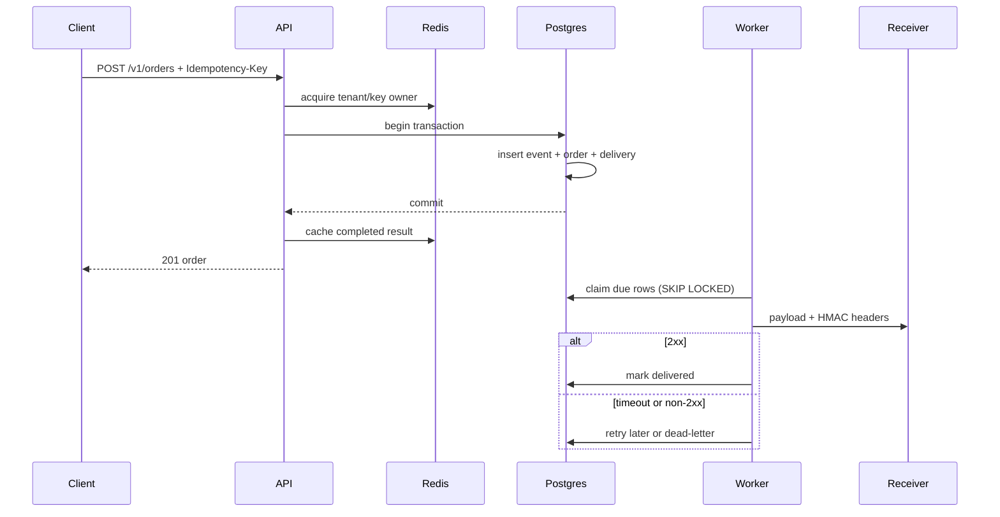

# Product runtime

The product runtime turns the reliability mechanisms into a small, deployable order and webhook backend. It is intentionally separate from the in-memory fault lab so reviewers can inspect both the policy mechanics and a durable implementation.

## Guarantees

| Requirement | Implementation | Verification |
| --- | --- | --- |
| Restart-safe orders | PostgreSQL orders and monotonic domain events | Product integration test and container demo |
| Duplicate suppression across replicas | Redis lock/result coordination | 20 concurrent HTTP requests execute once |
| Correctness during Redis outage | Unique `(tenant_id, idempotency_key)` constraint and stored request fingerprint | Fallback integration test |
| No order-without-notification gap | Order, event, and outbound delivery commit in one transaction | PostgreSQL transaction integration test |
| Safe callback retries | Exact-payload HMAC, processing lease, bounded exponential backoff | Failure-injecting receiver test |
| Recoverable terminal failure | Durable `dead_letter` status and explicit tenant-scoped replay API | Worker unit tests and admin API |
| Safe inbound examples | Timestamped Stripe-style HMAC and Shopify base64 HMAC | Signature and adapter unit tests |

## Request and delivery path



If Redis cannot be reached, the API logs and counts a coordination fallback, then attempts the PostgreSQL transaction directly. The database returns the original order for the same fingerprint and `409 Conflict` semantics for a different fingerprint.

## Local operation

```bash
make product-up
make product-demo
make product-logs
```

Local endpoints:

| Interface | URL |
| --- | --- |
| Product API | <http://127.0.0.1:58081> |
| Webhook receiver evidence | <http://127.0.0.1:58090/deliveries> |
| Metrics | <http://127.0.0.1:58081/metrics> |

Create an order:

```bash
curl -i -X POST http://127.0.0.1:58081/v1/orders \
  -H 'Content-Type: application/json' \
  -H 'X-API-Key: tenant-alpha-key' \
  -H 'Idempotency-Key: customer-order-001' \
  -d '{"event_id":"event-summer-jazz","quantity":2}'
```

Inspect a tenant's failed deliveries and replay one:

```bash
curl --fail \
  -H 'X-API-Key: tenant-alpha-key' \
  'http://127.0.0.1:58081/v1/webhook-deliveries?status=dead_letter' | jq .

curl --fail -X POST \
  -H 'X-API-Key: tenant-alpha-key' \
  http://127.0.0.1:58081/v1/webhook-deliveries/wh_example/retry
```

## Webhook contract

Outbound deliveries include:

- `X-Northstar-Delivery`: stable delivery ID;
- `X-Northstar-Event`: event type such as `order.confirmed`;
- `X-Northstar-Signature`: `t=<unix>,v1=<hex HMAC-SHA256>` over `<unix>.<raw body>`.

Receivers should verify the signature against the raw request body, enforce a timestamp tolerance, and make their own handling idempotent by delivery ID. The local receiver uses the same verification helper and intentionally rejects its first two valid requests.

## Incident playbook

### PostgreSQL unavailable

`/readyz` returns `503`; order writes fail and no partial event/outbox rows commit. Restore database connectivity, inspect PostgreSQL saturation and locks, then retry the original client request with the same idempotency key.

### Redis unavailable

`/readyz` returns `503`, while authorized order requests continue through the logged PostgreSQL fallback. Restore Redis, check `northstar_product_coordination_fallback_total`, and confirm latency/database load returns to baseline. Duplicate correctness remains owned by PostgreSQL.

### Webhook receiver failing

Inspect `northstar_product_webhook_deliveries_total{result=...}` and `GET /v1/webhook-deliveries`. Correct the receiver or credentials, then replay retained dead letters explicitly. Do not edit or regenerate stored payloads during incident recovery.

## Deployment boundaries

The Compose secrets are local fixtures. A real deployment should provide secrets from a managed secret store, use TLS for PostgreSQL/Redis, restrict the admin endpoints with roles, lock migrations to one release task, configure backups and restore drills, route metrics to alerts, and map inbound commerce secrets per tenant. The adapters never contact live Stripe or Shopify APIs.
